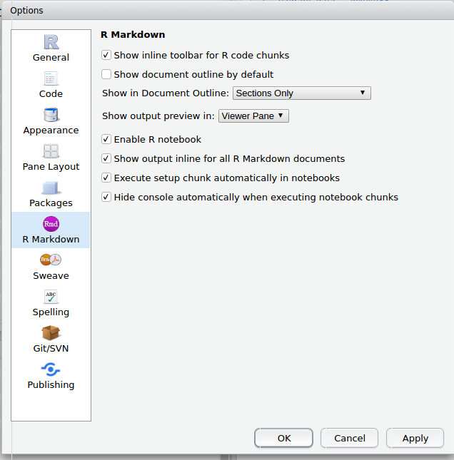
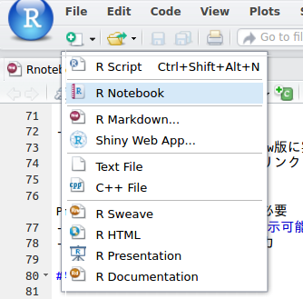
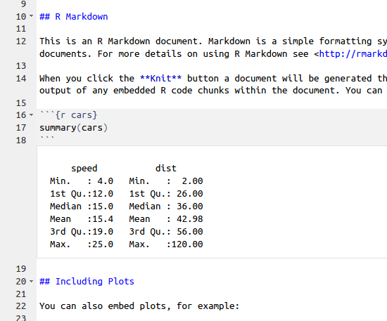

```{r setup, include=FALSE}
knitr::opts_chunk$set(echo = TRUE)

```

# はじめに

## 自己紹介

<div class="column1">
- 比治山大学短期大学部
- @kazutan
    - Twitter
    - GitHub
    - Qiita
- http://blog.kz-md.net/
- **Rおじさん**になりたい
</div>
<div class="column2">

</div>

## 今日のお話

- Rmdの不満
- R Notebook
- R Notebookの仕組み
- 便利なTips
- 注意点

# Rmdの不満

## R Markdownとは

- Rでドキュメント生成
    - ベースはMarkdwon
    - チャンクを組み込むことでコード評価
    - 他にもすげぇのたくさん
- 「なにそれ?」
    - "rmarkdown gihyo"でおググりください

## R Markdownへの不満

- ドキュメント生成はすごい
- でも、出力結果を見るにはknitしないといけない
    - 毎回レンダリングするのは面倒
    - チャンク内のコードだけを実行できるけど、ConsoleもしくはPlotsに出てくる
    - 某Notebookみたいに、すぐ下にでてきてほしい
- R Notebookはいかがでしょう?

# R Notebook {#whatis}

## R Notebookとは

- R Markdownのoutputのひとつ
    - 2016年夏にRStudioのPreview版に実装
    - 公式ドキュメントは以下のリンク:  
    http://rmarkdown.rstudio.com/r_notebooks.html
    - 2016/07/30時点でRStudio Preview版と{rmarkdown}開発版が必要
- **Rmd編集ウィンドウで出力が表示可能**
- **`.nb.html`**という形式で出力

## 使ってみよう

<div class="column1">
1. RStudioのPreview版を準備
2. {rmarkdown}のgithub版を入れる
3. RStudioで"Tools - Global Options..."へ
4. "R Markdown"で"Enable R notebook"のチェックをOnに
</div>
<div class="column2">

</div>

---

<div class="column1">
 "File - R Notebook"を選択

</div>
<div class="column2">
Rmdを編集し、チャンクのコードを実行

</div>

# R Notebookの仕組み {#sikumi}

## 基本はRmd

- 中身の作り方はRmdと同一
    - 基本`html_document`で考えてください
    - 冒頭のyamlで設定できる項目については、`?rmarkdown::html_notebook`を参照
- 注意点は後述

## `.nb.html`形式

- R Notebook HTML Formatという形式とのこと
- 一見はいつものRmd出力のhtmlと同一だけど…
    - 内部はかなり違う
    - 詳しくは以下のドキュメント参照  
    http://rmarkdown.rstudio.com/r_notebook_format.html
    - この中に**Rmdの内容が組み込まれている**

## 特色

- チャンクコードを実行すると、Consoleに送られる
    - その内容を現在の環境で実行して、チャンクの下に出してくる感じ
- もちろんPlotsも同じ
    - 編集ウィンドウに出てくるときは、自動的に黄金比で出てくる
    - ウィンドウの横幅が変化すると、そのたびに再度(実行してるの全て)出力してくる

# 便利なTips

## ショートカットキー

- Ctrl(Cmd) + Shift + Enter
    - 今いるチャンク内のコードを実行
    - 多分これは必須ショートカット
- Ctrl(Cmd) + Alt + I
    - Rチャンクを挿入
    - 事前に選択してショートカットすると、そこが独立してRチャンクに
- Ctrl(Cmd) + Shift + K
    - Preview(Knit)を実行
    - ドキュメント内のチャンクはすべて再度実行される

## 出力の全消去・折りたたみ・展開

- 出力の全消去
    1. 編集ウィンドウの上にある歯車ボタンをクリック
    2. "Clear All Output"でクリア
- 出力の全折りたたみ
    1. 編集ウィンドウの上にある歯車ボタンをクリック
    2. "Collapse All Output"で全部折りたたみ
- 出力の全展開
    1. 編集ウィンドウの上にある歯車ボタン
    2. "Expand All Output"で全部展開

## Rmdファイルの復元

- `.nb.html`ファイルには`.Rmd`が組み込まれている
- もしRmdファイルがなくても復元可能
    1. ファイルウィンドウで`.nb.html`をクリック
    2. "Open in Editor"を選択
    3. **該当RmdがなくてもRmdファイルが作成され開く!!**
    
# 注意点

##  `self_contained: FALSE`はNG

- いろいろ試したのですが、うまくいきません
    - helpには「やらんでね」と名言はなかったけどそういう趣旨の文言があった
    - というより、この機能の趣旨にあいません

## "Rmd Download"の罠

- `.nb.html`で出したドキュメントの右側に"Code"というボタンが
    - 全コードの表示・非表示を選択可能
    - この中に**Download Rmd**をクリックするとDLできる
- 日本語がうまくいかない
    - これできたら最高なので、誰か助けてください

## 中途半端な実行

- "Ctrl + Enter"で一行ごとで実行可能
- でも、中途飯場に実行してると想定外のことになるかも
    - Rチャンクの右上に"Run All Chunks Above"というボタンを!

# さいごに

## 結局、使いどころは?

- メモを取りながら作業するとき
    - まだカチッとしたドキュメントを作る段階じゃない、でもある程度は…
    - outputを他のに切り替えれば、すぐに他の形式に出せるしね
- Rmdをtear(別ウインドウで切り離す)して単体で作業
    - 画面半分くらいで十分なので、の垢離半分は別の作業できる
- Rmdファイルもセットで配布させたい時
    - .nb.htmlのファイルさえあれば復元可能なので

## 参考資料

- [RStudio Preview](https://www.rstudio.com/products/rstudio/download/preview/)
- [R Markdown Notebooks](http://rmarkdown.rstudio.com/r_notebooks.html)
- [R Notebook HTML Format](http://rmarkdown.rstudio.com/r_notebook_format.html)
- [Introducing Notebooks with R Markdown &#8211; RStudio](https://www.rstudio.com/resources/webinars/introducing-notebooks-with-r-markdown/)
- [上の動画の資料](https://github.com/rstudio/webinars/tree/master/25-Notebooks)

## Enjoy!

- 本発表の資料・スライドはこちら  
https://kazutan.github.io/TokyoR55/